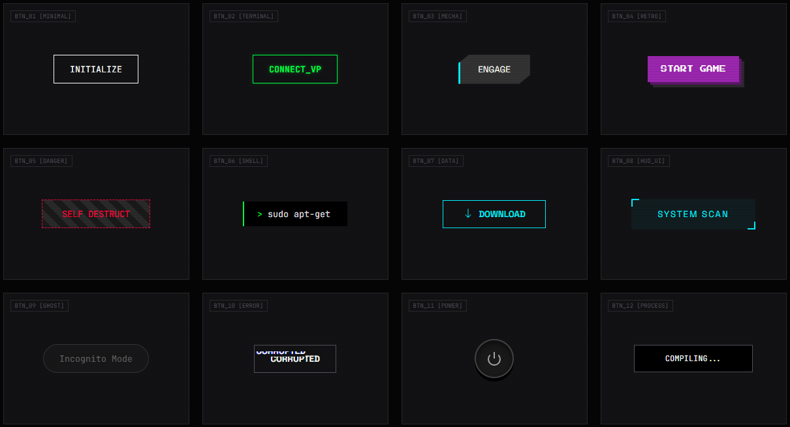

  

# ⚡ CYBER BUTTONZ — Futuristic Button UI Collection

A collection of **high-quality futuristic, cyberpunk, hacker-style UI buttons** designed using modern CSS.  
Perfect for **dashboards, games, terminals, sci-fi websites, HUD interfaces**, or anything that needs a **tech + neon aesthetic**.

All buttons are original and protected under a **custom no-repost license**.  
If you share the code, you **must link back to this repository**.

---

## 📁 Source Code Map (Your Project Structure)

| Folder / File | Description |
| ------------- | ----------- |
| `assets/` | Contains images, banner, and style references |
| `css/` | All button style CSS files |
| `html/` | Button demo pages and previews |
| `buttons/` | Individual button style folders |
| `LICENSE.md` | Custom license created to protect designs |
| `README.md` | This file |

> [!TIP]
> Each button style has its own folder with dedicated CSS and HTML so users can test easily.

---

## 🔧 How to Use

1. Clone or download this repo  
2. Open any HTML file inside **buttons/** or **html/**  
3. Copy the HTML + CSS **inspired by the style**  
4. Write your own implementation (required by license)

---

## 🔥 Button Categories

- **Minimal Cyber** — clean, modern, futuristic
- **Terminal / Hacker** — green/amber CLI effects  
- **Mecha UI** — robotic sharp edges  
- **Retro Neon** — glowing pixel-style buttons  
- **Danger / Error / Corrupt** — glitch animations  
- **HUD Elements** — sci-fi scanning effects  
- **Ghost / Power / Process** — animated interactions  

More styles coming soon…

---

## 🤝 Contributing

Want to add your own *inspired* cyber-style button?

1. Fork this repo  
2. Create a **new folder** inside `/buttons/`  
3. Add your HTML + CSS  
4. Make sure it’s **100% your code** (no copying)  
5. Submit a pull request  
6. We will review and merge if approved

> [!IMPORTANT]
> Do **NOT** copy existing code. Only **original inspired designs** are accepted.

---

## 📝 Commit Message Rules

Use a clear commit prefix:

- `feat:` — new button style  
- `fix:` — fix CSS or demo issue  
- `style:` — visual improvements  
- `refactor:` — clean up structure  
- `docs:` — update README or comments  
- `chore:` — folder rename, asset update

Examples:

